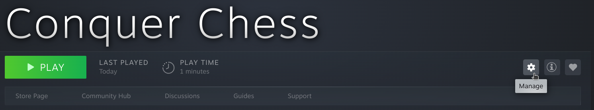
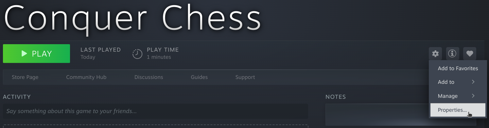
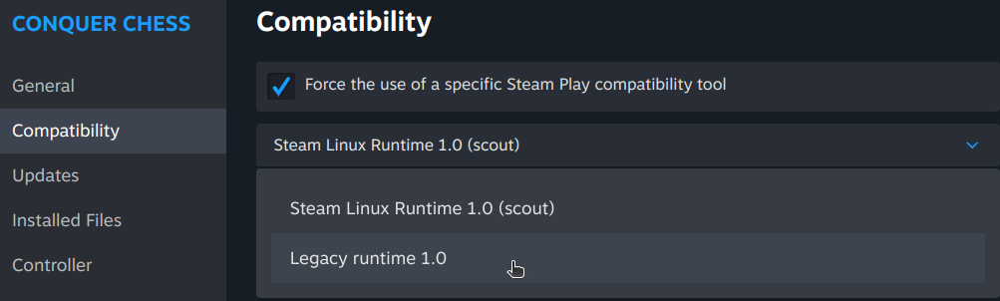

# Launch on Steam

!!! info "This is an example"

    This is an example page on how a game may document
    what a user needs to do to launch a game.

    The example game used is called
    [Conquer Chess](https://richelbilderbeek.github.io/conquer_chess/),
    which is a FOSS game developed under Linux in C++.

Conquer Chess does not launch out of the box yet.
This is being worked on.

For now, here are the steps to launch Conquer Chess on Steam.

???- question "Prefer a video?"

    Then watch the YouTube video
    [Conquer Chess: how to launch from Steam and report a bug](https://youtu.be/DT8WSVPvu9w)

## 0. Install the dependencies

Conquer Chess is not yet provided as
[a stand-alone Linux executable](https://github.com/richelbilderbeek/conquer_chess/issues/120).
For now, these libraries must be installed by the user :-/

In a terminal, install the Qt and SFML libraries:

```bash
sudo apt install libqt6core6t64 libqt6gui6t64 libqt6widgets6t64 libsfml-* 
```

This is only partially tested on Ubuntu 24.04 LTS
and is not tested on other Linux distributions.

## 1. Click on 'Manage'

In Steam, go to 'Conquer Chess' in your Steam Library and click on 'Manage'.



## 2. Click on 'Properties'

In the 'Manage' pop-up menu, click on 'Properties'



## 3. Activate 'Legacy runtime 1.0'

In the 'Properties dialog', go the 'Compatibility' tab
and force the use of 'Legacy runtime 1.0':



## 4. Play Conquer Chess

Click on 'Play' to start Conquer Chess.

If nothing happens, try to run the game from the terminal:

```bash
cd ~/.local/share/Steam/steamapps/common/conquer_chess
./conquer_chess
cat conquer_chess_error.txt
```

Please
[report a bug](https://richelbilderbeek.github.io/conquer_chess/report_a_bug/)
with the error messages.
