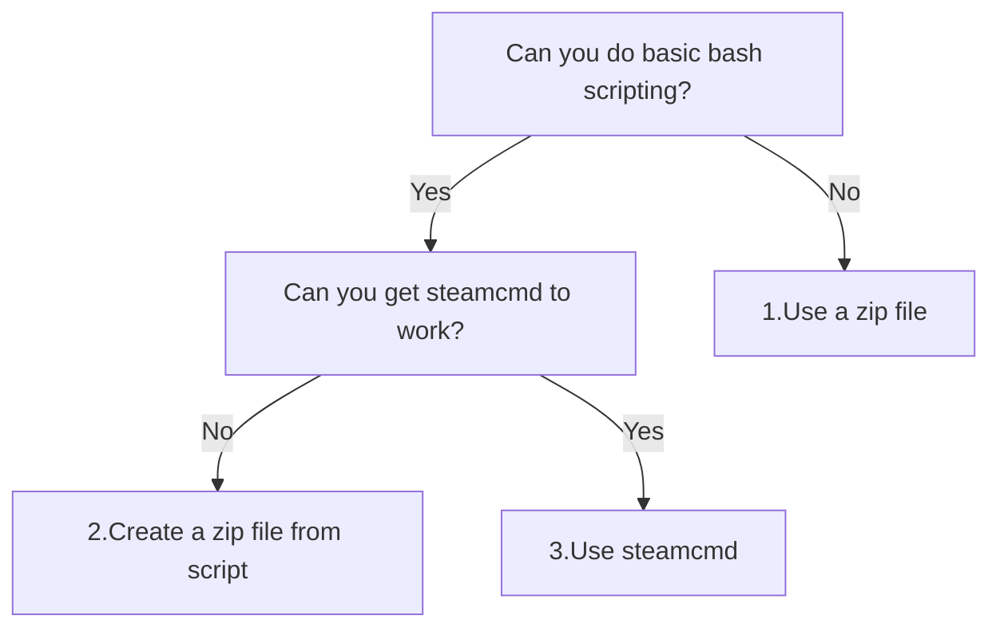

# How to upload your game

You want to upload your game (and optionally some more files
that it needs).

There are these options:

- `[1]` Use a zip file and upload
- `[2]` Create a zip file from a script and upload
- `[3]` Use `steamcmd` and some Valve Data Format (`.vdf`) files

Here is a comparison of the features of these approaches:

<!-- markdownlint-disable MD013 --><!-- Tables cannot be split up over lines, hence will break 80 characters per line -->

Option                               |Advantages      |Disadvantages
-------------------------------------|----------------|------------------------------------------------------------
`[1]` Use a zip file                 |Easiest to do   |Clumsy, manual steps, does not scale with more complex games
`[2]` Create a zip file from a script|Allows scripting|Still requires manual steps
`[3]` Use `steamcmd`                 |Allows scripting|Need to install and learn `steamcmd` and the VDF format

<!-- markdownlint-enable MD013 -->

Here is a decision tree:



## `[1]` Use a zip file and upload

This option only involves clicking in the right places.

- Zip your game files in your file explorer
- Upload the zip file on Steamworks

## `[2]` Create a zip file from a script and upload

This option involves writing and running a script to
create a zip file, then clicking to upload it.

- Write a script to zip the game files
- Run the script to zip the game files
- Upload the zip file on Steamworks

This script can be very simple.
Below is a Bash script that zips the executable called `my_game`
to a zip file called `my_game.zip`.

```bash
#!/bin/bash
zip my_game.zip my_game
```

## `[3]` Use `steamcmd` and some Valve Data Format (`.vdf`) files

This option involves writing Valve Data Format files (these
are the files in which you state the location of your game files)
and then using `steamcmd` to upload the files.

- Write the `.vdf` files, which are 1 `AppBuild` file
  and 1 or more `DepotBuild` files

???- question "Could you give an example `AppBuild` file?"

    Below is an example `AppBuild` file.
    It assumes that there is a `DepotBuild` file
    called `depot_build_3873941.vdf`.


    ```text
    "AppBuild"
    {
      "AppID" "3873940" // your AppID
      "Desc" "My first VDF files" // internal description for this build

      "ContentRoot" "." // root content folder, relative to location of this file
      "BuildOutput" "." // build output folder for build logs and build cache files

      "Depots"
      {
        // file mapping instructions for each depot are in separate script files
        "3873941" "depot_build_3873941.vdf"
      }
    }
    ```

???- question "Could you give an example `DepotBuild` file?"

    Below is an example `DepotBuild` file.
    To be able to work together with the example `AppBuild` file,
    this file must be called `depot_build_3873941.vdf`:

    ```text
    "DepotBuild"
    {
        "DepotID" "3873941"
        "ContentRoot" "../"

        "FileMapping"
        {
            "LocalPath" "conquer_chess"
            "DepotPath" "."
            "Recursive" "1"
        }
        "FileExclusion" "*.png"
        "FileExclusion" "*.ogg"
        "FileExclusion" "*.jpg"
        "FileExclusion" "*.ttf"
        "FileExclusion" "*.txt"
        "FileExclusion" "*.csv"
    }
    ```

- Install `steamcmd` from
  [the Valve developer community website](https://developer.valvesoftware.com/wiki/SteamCMD)
- In `steamcmd`, run `login` to login
- Run `run_app_build my_app_build.vdf` to upload the files
